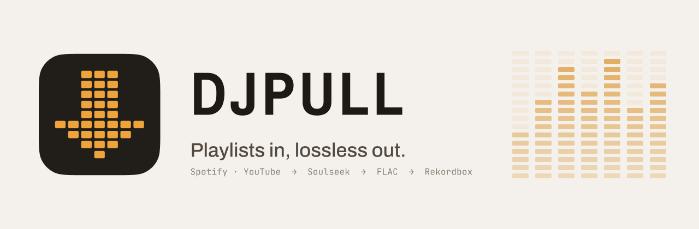
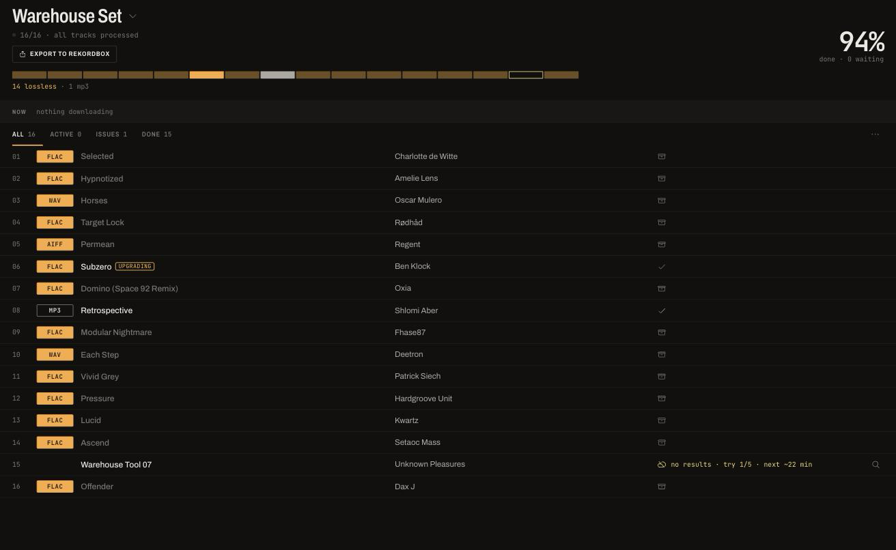
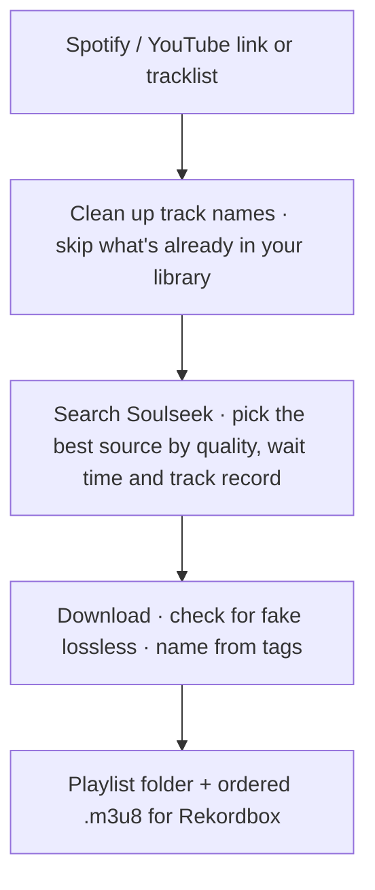

<picture>
  <source media="(prefers-color-scheme: dark)" srcset="assets/header-dark.png">
  
</picture>

<p align="center">
  <a href="https://github.com/oguzsamsa/djpull/releases/latest"></a>
  
  
  
</p>

<p align="center">
  <a href="https://github.com/oguzsamsa/djpull/releases/latest"><b>⬇ Download for macOS or Windows</b></a>
</p>

<p align="center">
  
</p>

**djpull** turns a Spotify or YouTube playlist into a folder of lossless files, ready for Rekordbox. Paste a link, and it finds every track on Soulseek, picks the best source, downloads it, names it properly and hands you an ordered playlist file.

## Why

You build your sets on Spotify or YouTube, but CDJs need real files, ideally FLAC, WAV or AIFF. Soulseek has almost everything, yet getting a 90-track playlist from it by hand takes hours: searching track by track, guessing which spelling finds results, waiting in queues that never move, and finding out later that some "FLACs" were converted from MP3s.

djpull does that work for you. Start a playlist, walk away, and come back to a folder of files.

## Features

- **Paste anything.** Spotify playlists and albums, YouTube and YouTube Music playlists, or a plain "Artist - Title" tracklist (1001Tracklists, djooni…).
- **Lossless first.** FLAC, WAV, AIFF or ALAC whenever it exists. djpull estimates how long each source will actually take and waits for lossless when it is worth it; MP3 is the last resort.
- **Knows the uploaders.** It keeps a track record of every user it downloads from. Users who never deliver are blacklisted automatically (including their look-alike accounts); reliable ones are trusted even with long queues. You can pin anyone yourself.
- **Catches fake lossless.** Every downloaded FLAC/WAV gets a spectrum check. Files converted from MP3 are flagged, and djpull looks for a real one.
- **Upgrades later.** If only an MP3 was available, djpull keeps looking in the background and replaces it when real lossless shows up. The old file goes to the Trash, never deleted.
- **Smart search.** Messy YouTube titles are cleaned up (track numbers, BPM, "vs", "Official Video"), accents and alternative spellings are tried, and djpull learns from your manual corrections.
- **Skips what you have.** Point it at your music library, and tracks you already own are not downloaded again.
- **Ready for Rekordbox.** Files are named `Artist - Title` from their own tags, one folder per playlist, with an ordered `.m3u8` next to them. In Rekordbox: *File → Import → Import Playlist*.
- **Stuck downloads move on.** A download that doesn't start is moved to another source, never to a lower quality.
- **Everything built in.** Soulseek client, sharing and messages included; no separate app needed. English and Turkish interface, automatic updates.

## How it works



## Install

You need a Soulseek account; djpull can create one for you.

### macOS

Requirements: a Mac with Apple Silicon (M1 or later), macOS 12 or newer.

1. Download `djpull_…_aarch64.dmg` from the [latest release](https://github.com/oguzsamsa/djpull/releases/latest) and open it.
2. Drag **djpull** into **Applications**.

#### First launch on macOS

djpull is not signed by an Apple-registered developer yet, so macOS blocks it the first time:

1. Open **djpull** from Applications. When you see "Apple could not verify djpull is free of malware", click **Done** (not *Move to Trash*).
2. Open **System Settings → Privacy & Security**, scroll down, and click **Open Anyway** next to "djpull was blocked". Enter your Mac password.
3. Open djpull again and confirm with **Open Anyway**.

You only do this once. If macOS says djpull "is damaged and can't be opened", download it again; if that doesn't help, run this in Terminal:

```
xattr -dr com.apple.quarantine /Applications/djpull.app
```

### Windows

Requirements: Windows 10 or 11, 64-bit (x64).

1. Download `djpull_…_x64-setup.exe` from the [latest release](https://github.com/oguzsamsa/djpull/releases/latest) and run it. It installs for your user only; no administrator password needed.
2. djpull is not signed with a paid certificate yet, so Windows may show **"Windows protected your PC"**. Click **More info → Run anyway**.
3. On first launch, Windows Firewall may ask about **slskd** (djpull's Soulseek client). Click **Allow**; otherwise other users can't connect to you.

### Setup

On first launch djpull walks you through three steps:

1. **Soulseek account.** Sign in with your existing account, or make up a new username and password (there is no password recovery, so write them down). Don't use the same account in another Soulseek app while djpull is open; Soulseek allows one session per account.
2. **Folders.** Downloads go to `Music/djpull`. Add your music library (for example your Rekordbox folder) so tracks you already have are skipped. On macOS the Desktop, Documents and Downloads folders can't be used, because macOS blocks them for background apps.
3. **Sharing.** Everyone on Soulseek shares, and many users won't upload to you if you share fewer than about 500 files. Others only see folder names, never paths on your Mac. Your Rekordbox database is never shared.

On macOS, when asked, allow **local network** access: djpull uses it to open the Soulseek port on your router.

## FAQ

**Is it legal?** djpull is a Soulseek client with automation. What you download and share is up to you and the laws where you live. Please support the artists you play: buy their music on Bandcamp, Beatport or wherever they sell it.

**Why is my port "closed · CGNAT"?** Your internet provider puts you behind a shared IP (carrier-grade NAT), so nobody can connect to you directly, and you can't download from users whose port is also closed. djpull can't fix this from your side. Ask your provider for a public IP address.

**Why did a track come as MP3?** No lossless copy was available, or only from users who never deliver. djpull keeps looking and upgrades the file automatically when one shows up.

**Can I search myself?** Yes. Any track can be searched manually with your own words, and djpull learns spelling fixes you make for an artist.

**How do I report a problem?** Open an [issue](https://github.com/oguzsamsa/djpull/issues) and attach `panel.log` and `slskd.log` from djpull's data folder: `~/Library/Application Support/djpull` on macOS (Finder → Go → Go to Folder), `%APPDATA%\djpull` on Windows (paste it into the File Explorer address bar). The version number is shown in djpull's connection box.

**Uninstall:** on macOS, move djpull from Applications to the Trash; on Windows, use *Settings → Apps → djpull → Uninstall*. To remove settings too, delete the data folder above. Your music stays in `Music/djpull`.

## Built with

[Tauri](https://tauri.app) for the desktop app, Python for the engine, [slskd](https://github.com/slskd/slskd) as the Soulseek client, and React for the interface.

djpull bundles unmodified releases of slskd 0.26.0 (AGPL-3.0, [source](https://github.com/slskd/slskd/tree/0.26.0)) and CPython 3.12 (PSF License). Full third-party notices are included in the app.

## Platforms

macOS on Apple Silicon and Windows 10/11 (x64). On Windows, the fake-lossless check is not available yet; everything else works the same.
